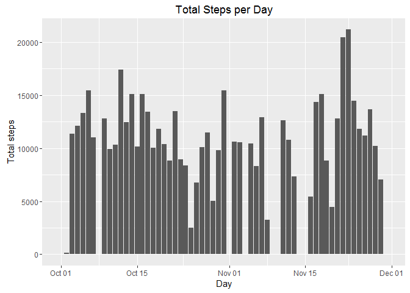
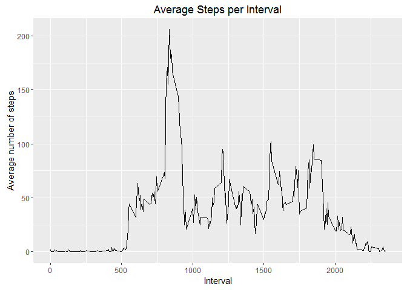
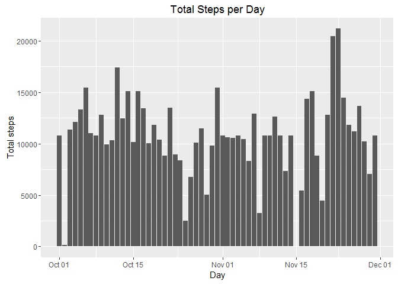
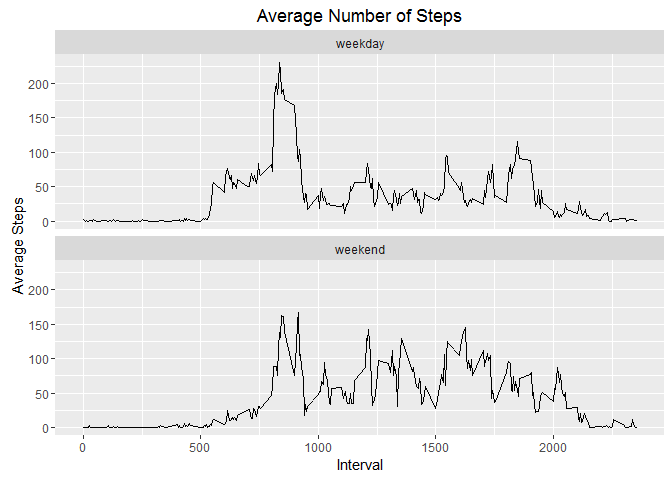

# Reproducible Research: Peer Assessment 1
Linda Wong  

## Coursera - Reproducible Research : Week 1 Course Project 1
This script assumes that the following zip file `activity.zip` is already saved
in the current working directory.  If not, please download it from [HERE](https://d396qusza40orc.cloudfront.net/repdata%2Fdata%2Factivity.zip) and
save it in your current working directory.

### Version History
Date       | Version | Comments
---------- | ------- | ---------------------------------------------------------
2016-04-03 | 0       | Initial (Zip file downloaded on 2016-04-01 0730 SGT)
2016-04-04 | 0.1     | Updated last plot from sum to mean

## Loading and preprocessing the data
1. Unzip the file
2. Read in csv file with `na.strings = "NA"` (17,568 rows of 3 columns)
3. Convert `date` column into Date class

```r
unzip("activity.zip")
data <- read.csv("activity.csv", na.strings = "NA")
data$date.new <- as.Date(data$date, "%Y-%m-%d")
```


## What is mean total number of steps taken per day?
1. Calculate the total number of steps taken per day
     + rename columns in new data frame
2. Make a histogram of the total number of steps taken per day
     + load `ggplot2` library
3. Calculate and report the mean and median of the total number of steps taken
per day

```r
data.perDay <- aggregate(data$steps, by = list(data$date.new), FUN = "sum",
                         na.rm = TRUE)
names(data.perDay) <- c("Date", "SumSteps")

library(ggplot2)
ggplot(data = data.perDay, aes(Date, SumSteps)) + 
    stat_summary(fun.y = sum, geom = "bar") +
    labs(title = "Total Steps per Day", x = "Day", y = "Total steps")
```



```r
paste("Mean steps = ", mean(data.perDay$SumSteps, na.rm = FALSE))
```

```
## [1] "Mean steps =  9354.22950819672"
```

```r
paste("Median steps = ", median(data.perDay$SumSteps, na.rm = FALSE))
```

```
## [1] "Median steps =  10395"
```


## What is the average daily activity pattern?
1. Make a time series plot (i.e. `type = "l"`) of the 5-minute interval (x-axis)
and the average number of steps taken, averaged across all days (y-axis)
     + rename columns in new data frame
2. Which 5-minute interval, on average across all the days in the dataset, 
contains the maximum number of steps?

```r
data.perInterval <- aggregate(data$steps, by = list(data$interval),
                              FUN = "mean", na.rm = TRUE)
names(data.perInterval) <- c("Interval", "AvgSteps")

ggplot(data = data.perInterval, aes(Interval, AvgSteps)) + geom_line() +
    labs(title = "Average Steps per Interval", x = "Interval",
         y = "Average number of steps")
```



```r
paste("5-minute interval with maximum average steps = ",
      data.perInterval[with(data.perInterval, AvgSteps == max(AvgSteps)), 1])
```

```
## [1] "5-minute interval with maximum average steps =  835"
```

```r
paste("With maximum average step = ",
      data.perInterval[with(data.perInterval, AvgSteps == max(AvgSteps)), 2])
```

```
## [1] "With maximum average step =  206.169811320755"
```


## Imputing missing values
1. Calculate and report the number of missing values in the dataset (i.e. the
total number of rows with `NA`s)
2. Devise a strategy for filling in all of the missing values in the dataset.
The strategy does not need to be sophisticated. For example, you could use the
mean/median for that day, or the mean for that 5-minute interval, etc.
3. Create a new dataset that is equal to the original dataset but with the
missing data filled in
     + load library dplyr
4. Make a histogram of the total number of steps taken each day and calculate
and report the *mean* and *median* total number of steps take per day. Do these
values differ from the estimates from the first part of the assignment? What is
the impact of imputing missing data on the estimates of the total daily number
of steps?
     + Mean and median number of steps has increased
     + Mean and median are now the same
     + Total daily number of steps has increased as NA values, originally
     ignored, have now a non-negative value

```r
paste("Number of rows with NAs = ", sum(is.na(data)))
```

```
## [1] "Number of rows with NAs =  2304"
```

```r
## fill in NAs with mean of 5-minute interval
library(dplyr, warn.conflicts = FALSE)
data.noNA <- merge(data, data.perInterval, by.x = "interval", 
                   by.y = "Interval") %>% 
             mutate(steps.new = ifelse(is.na(steps), AvgSteps, steps)) %>%
             select(interval, date.new, steps.new)

data.noNA.perDay <- aggregate(data.noNA$steps.new, by = list(data.noNA$date.new)
                              , FUN = "sum")
names(data.noNA.perDay) <- c("Date", "SumSteps")

ggplot(data = data.noNA.perDay, aes(Date, SumSteps)) + 
    stat_summary(fun.y = sum, geom = "bar") +
    labs(title = "Total Steps per Day", x = "Day", y = "Total steps")
```



```r
paste("Mean steps = ", mean(data.noNA.perDay$SumSteps, na.rm = FALSE))
```

```
## [1] "Mean steps =  10766.1886792453"
```

```r
paste("Median steps = ", median(data.noNA.perDay$SumSteps, na.rm = FALSE))
```

```
## [1] "Median steps =  10766.1886792453"
```


## Are there differences in activity patterns between weekdays and weekends?
1. Create a new factor variable in the dataset with two levels - "weekday" and
"weekend" indicating whether a given day is a weekday or weekend day
2. Make a panel plot containing a time series plot (i.e. `type = "l"`) of the
5-minute interval (x-axis) and the average number of steps taken, averaged
across all weekdays or weekend days (y-axis)

```r
data.noNA.perDayType <- mutate(data.noNA, dayType = 
                               ifelse(weekdays(date.new) %in% c("Sunday",
                                                                "Saturday"),
                                      "weekend", "weekday")) %>%
                        group_by(interval, dayType) %>%
                        summarise(mean(steps.new))
names(data.noNA.perDayType)[3] <- "SumSteps"

ggplot(data = data.noNA.perDayType, aes(interval, SumSteps)) + 
    facet_wrap(~dayType, ncol = 1) + geom_line() +
    labs(title = "Average Number of Steps", x = "Interval", y = "Average Steps")
```


